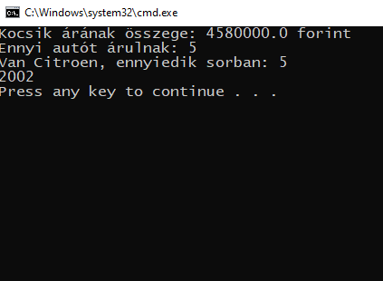

# Felhasználói dokumentáció

## Alkalmazás célja

Az alkalmazás járművek adatait olvassa be megadott CSV formátumú fájlból

## Telepítés

A program futtatásához Java futtató környezet szükséges.
A telepítéshez töltse le a caros2_uj.zip fájlt, majd csomagolja ki az ön számára megfelelő könyvtárba.

## Indítás

A caros2 könyvtárban talál egy start.bat nevű fájlt. A fájlkezelőben dupla kattintással megnyitható.

## Program használata

A program bevitel nélkül fut.

